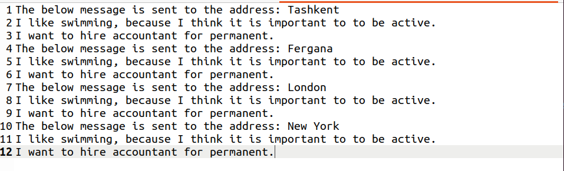

# EPAM-L1-TDD-messenger
You can run this application as a jar file.

It provides two modes: FILE mode and CONSOLE mode.
Enter 1 for CONSOLE mode or enter 2 for FILE mode.

#How CONSOLE mode works:
You directly write your template in the terminal.
A placeholder is denoted by #{something} where
something will be changed later on.

After you completely entered your template, 
press enter TWICE to move on to the next step.

Then, you will be asked to provide values
for the placeholders you wrote in your template.

Finally, You will be asked to enter addresses where 
you want to send messages to. Once you are done
entering all addresses you need to send the message to,
press enter TWICE to complete the process.

#How FILE mode works:
You need to provide ABSOLUTE paths for the input as well as
for the output files.
The program reads data from the input file, processes it, and 
then writes the result to the output file.
Note that input file must follow the application constraints.

#CONSOLE mode example:

#How input file needs to be structured:
body_start\
line 1 with possible placeholders\
line 2 with possible placeholders\
line 3 with possible placeholders\
body_end\
values_start\
placeholder1:value1\
placeholder2:value2\
values_end\
addresses_start\
address1\
address2\
address3\
addresses_end

#FILE mode example:
INPUT file:

OUTPUT file:

